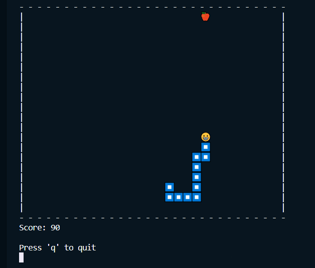

# Ruby Snake

## An In-Terminal Game

🐍 Classic snake game

Use you `wasd` keys to move the snake around the board.
(`,aoe` works too for Dvorak peeps 😉)

🍎 Your aim is to eat the ~~apples~~ assortment of food. As you eat the food, your body grows bigger. Don't run into yourself or the walls, or it's game over.

## To Start the Game

In terminal ▶️ `ruby main.rb` 